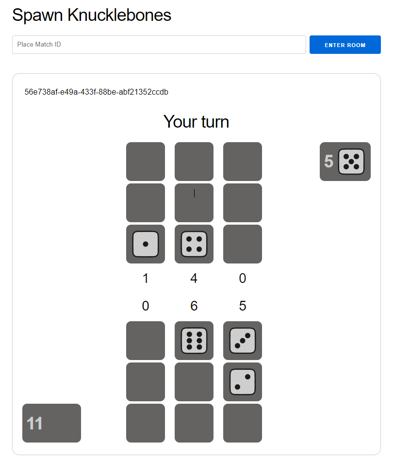

# Spawn Knucklebones Game

This is a game project demonstrating how to make use of the framework [Spawn](https://github.com/eigr/spawn) using [Spawn Elixir SDK](https://github.com/eigr/spawn/tree/main/spawn_sdk/spawn_sdk) on a simple LiveView project

## Why Spawn helps here?

With Spawn we are able to focus on the business domain of the game only and not worry about infrastructure.

One of the goals with this game is to be able to play whoever you want in the world with no noticeable latency, that is achieved by:
  - Having the definition of actors that mimic what a GenServer would do, but with Spawn's included batteries you focus only on your domain eliminating the boilerplate and gaining in return state management, guaranteed actor lifecycle among other things.
  - Spawn use of CRDTs to handle actor invocations
  - Spawn dealing with all infrastructure related with clustering
  - Spawn distributing actors automatically in the cluster
    - In this case you can have a Knucklebones Match in any cluster interacting with eachother
  - Being able to horizontally scale in different regions sharing the same in memory (or persisted) actor
  - Having events from actor invocations being broadcasted to liveview using Elixir capabilities
  - Having the ability to have custom invocations from different implementations that connect with the game
    - For example, if we were to make this game interactive with Twitch Chat or something like that, this twitch chat communication service could be done in any language that has a Spawn SDK support

## Actor definitions

See Spawn Actor definitions for:

  - [Matchmaking](./lib/dice/matchmaking/matchmaking_actor.ex)
    - [Matchmaking Actor Proto Definitions](./priv/protos/matchmaking.proto)
  - [Game](./lib/dice/game/match_actor.ex)
    - [Game Actor Proto Definitions](./priv/protos/game/match.proto)

## Game Overview

Knucklebones is a multiplayer game with the following rules:

- The game is defined by 3 columns
- Every round you get a random dice number
- You can choose which column to stack your dice
- Each column represents the value of the sum* of the dices
  - For each dice of the same number in the column, you multiply its value by how many of the same number there are.
- The game ends when any player places a dice in the last spot available
- The winner is whoever has the biggest columns sum
- If you place the same number as a number in the opponents column, all of the dices of the opponent with the same number are popped from the column stack



## Running

### Using minikube and kubectl

Make sure you have installed `minikube` and `kubectl`

Run the following commands sequentially

```BASH
make start-minikube
make k8s-create-ns
make k8s-create-operator
make k8s-apply-mysql
make k8s-create-mysql-connection-secret
make k8s-apply-system 
make k8s-apply-host
make k8s-proxy
```

It will forward a port to 8800, you can see it running in http://localhost:8800

## Destroy

```shell
make k8s-delete-all
```

### In dev mode assuming you have up and running MySQL

To run locally in dev mode:

  * Install dependencies with `mix deps.get`
  * Start with `mix phx.server` or inside IEx with `iex -S mix phx.server`

Now you can visit [`localhost:4000`](http://localhost:4000) from your browser.
